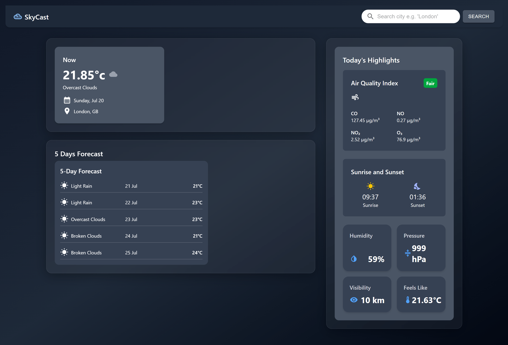

# SkyCast - Weather Forecast App



SkyCast is a clean and responsive weather dashboard built using **React.js**, **Tailwind CSS**, and **OpenWeatherMap APIs**. It allows users to search for any city and view the current weather, 5-day forecast, air quality data, and highlights like wind speed, pressure, and humidity.

---

## 🚀 Features

- 🌤 Current weather conditions based on city input
- 📍 Fetch weather for your current location (with Geolocation)
- 📅 5-day weather forecast (temperature, weather condition)
- 📈 Today’s highlights (wind speed, humidity, air quality, sunrise/sunset)
- 📱 Responsive UI optimized for both desktop and mobile
- ✨ Clean and modern glassmorphism design using Tailwind CSS

---

## 📁 Project Structure

```
skycast/
├── public/
├── src/
│   ├── components/
│   ├── pages/
│   ├── assets/
│   └── App.jsx
├── .env.example
├── .gitignore
├── README.md
└── package.json
```

---

## 🔧 Tech Stack

- **Frontend:** React, Tailwind CSS
- **API:** OpenWeatherMap (Weather + Air Quality)
- **Icons:** Material UI Icons
- **Deployment:** [Vercel](https://vercel.com)

---

## 🌐 Setup Instructions

1. **Clone the repository**

   ```bash
   git clone https://github.com/iamvivekanand01/skycast.git
   cd skycast
   ```

2. **Install Dependencies**

   ```bash
   npm install
   ```

3. **Environment Variables**

   Create a `.env` file in the root directory and add your OpenWeatherMap API key:

   ```env
   VITE_WEATHER_API_KEY=your_api_key_here
   ```

4. **Run the App**

   ```bash
   npm run dev
   ```

---

## 📸 Screenshot

A screenshot of the app is included in the `screenshots/` folder to showcase the layout and functionality.

---

## 📄 License

This project is developed by **Vivekanand** for learning purposes.  
Feel free to use and modify it.

---

## 🔗 Links (update later)

- **Live App**: _Coming Soon_
- **GitHub Repo**: _Coming Soon_

---

## 👨‍💻 Author

**Vivekanand**  
GitHub: [iamvivekanand01](https://github.com/iamvivekanand01)
